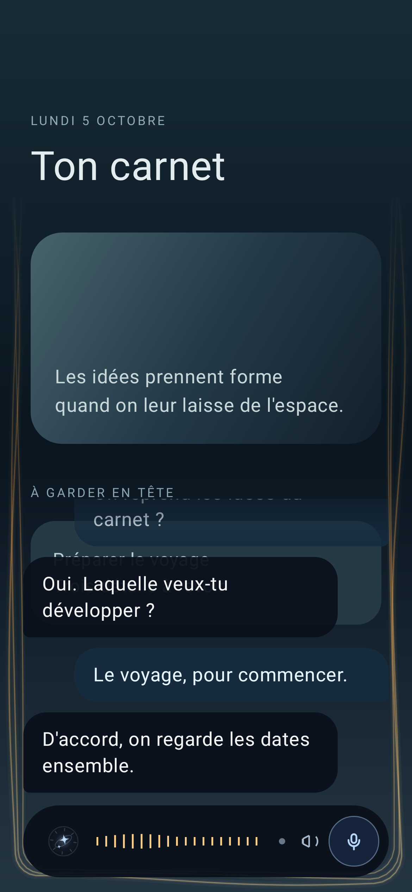

# Sirius, assistant vocal Android

Mon assistant personnel en application Android native. Je parle, il répond à voix haute, et il peut agir sur le téléphone quand je l'autorise. Il se réveille avec « Dis Sirius », détecté directement sur l'appareil, sans réseau en veille.

 

## Ce que fait l'app

- Conversation à la voix, avec le texte qui s'affiche pendant que je parle puis la réponse de Sirius dans la même bulle.
- Mot d'éveil local avec Vosk (petit modèle français téléchargé au premier lancement), avec des mots leurres pour éviter les faux réveils.
- Pilotage du téléphone sur autorisation, avec un journal des actions.
- Adresse du serveur et identifiants saisis dans l'app et chiffrés avec Android Keystore : rien n'est écrit dans le code.

## Stack

Kotlin, Jetpack Compose et Material 3, Android 12 minimum (API 31), cible Android 16 (API 36). Vosk pour le mot d'éveil. Captures d'écran automatiques avec Roborazzi.

## Construire

```sh
./gradlew :app:testDebugUnitTest :app:lintDebug :app:assembleDebug
```

Sans configuration, l'APK est signé avec la clé debug par défaut d'Android.

## Intégration continue (non incluse)

Dans mon dépôt de travail, un workflow GitHub Actions construit l'APK à chaque commit : tests unitaires, lint, assemblage, captures Roborazzi, puis l'APK en artefact. Il n'est pas recopié ici, parce qu'il a besoin d'un secret.

Pour le reproduire dans un fork :

1. Créer une clé de signature au format PKCS12 (alias `androiddebugkey`, mots de passe `android`, comme la clé debug d'Android), puis l'encoder en base64.
2. L'enregistrer comme secret Actions `DEBUG_KEYSTORE_B64` dans les réglages du dépôt.
3. Dans le workflow (Java 17, Temurin), décoder le secret dans `$RUNNER_TEMP/sirius-debug.p12` et exporter son chemin dans la variable `SIRIUS_DEBUG_KEYSTORE`, puis lancer la commande ci-dessus.

`app/build.gradle.kts` lit `SIRIUS_DEBUG_KEYSTORE` : avec une clé fixe, chaque nouvel APK s'installe par-dessus le précédent sans désinstaller l'app. Sans la variable, Gradle reprend la clé debug locale.

Le dossier `e2e/` contient les tests de bout en bout (émulateur Android, faux serveur et scénarios).

## Côté serveur

L'app parle à un serveur HTTPS (la page voix de mon assistant). Il n'est pas inclus dans ce dépôt ; l'adresse se règle dans Réglages > Connexion.
